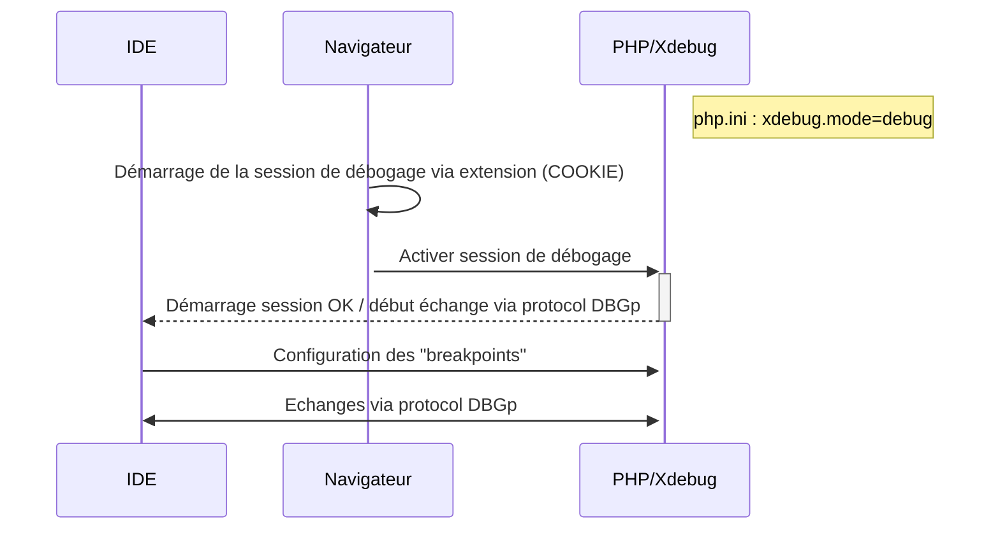
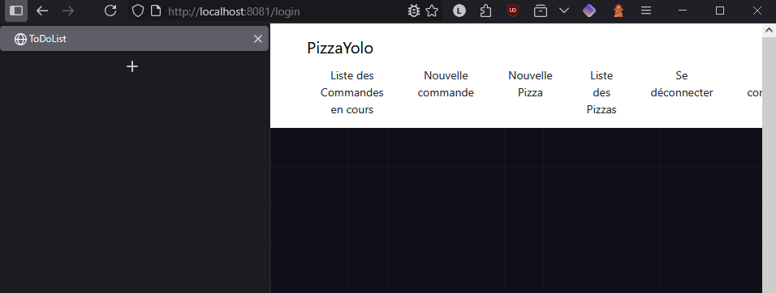

# Installation de PHP

Il est possible d'installer PHP en utilisant Winget et la commande suivante :

```sh
winget install PHP.PHP.8.4.2
```

Pour vérifier la bonne installation de PHP et la mise à jour correcte des variables d'environnement, utiliser la commande suivante :

```sh
php --version
```

# Mise en place de composer

## Installation

[Composer est un outil de gestion de dépendances pour PHP](https://getcomposer.org/doc/00-intro.md).

Il permet de :
- gérer les dépendances (bilbiothèques utilisées par le projet)
- faciliter la mise à jour : simplification de la mise à jour des bibliothèques.
- utiliser un **autoloader** : permet de trouver automatiquement les fichier à importer lorsque l'on souhaite utiliser une classe.

Procédure d'installation :
1. Télécharger et installer Composer
  - récupérer l'installateur sur le [site officiel](https://getcomposer.org/download/)
  - démarrer l'installateur et installer l'outil pour tous les utilisateurs

2. Modification de la variable d'environnement PATH
  - ajouter le dossier contenant les exécutables de `composer` dans le `PATH`

Il est possible de vérifier la bonne installation de l'outil avec la commande suivante :

```sh
composer --version
```

## Initialisation d'un projet

1. Création d'un nouveau projet :
- se positionner dans un dossier dans lequel sera créer le projet
- utiliser la commande d'initialisation :
```sh
compose init
```
- suivre les instructions

2. Installation de dépendances répértoriée sur [Packagist](https://packagist.org/) :
- ajouter une dépendance avec :
```sh
composer require <nom-paquet>
```

Plus d'informations disponibles sur composer sur l'article disponible [ici](https://www.dev-metal.com/composer-tutorial/).

# Procédure d'activation de xDebug

## Principe de fonctionnement

- XDebug tourne dans le conteneur Docker (PHP-FPM ou Apache/Nginx).
- Le navigateur déclenche le débogage via un cookie ou un paramètre GET (XDEBUG_SESSION).
- XDebug se connecte à l'IDE (PHPStorm, VSCode, etc.) via un port dédié (généralement 9003).
- L’IDE écoute et permet de suivre l’exécution du code.

Il est important de noter que c'est l'IDE qui va écouter les évènements générés par le serveur. Pour plus d'informations concernant le fonctionnement de XDebug vous pourrez consulter l'article disponible [ici](https://crosp.net/blog/software-development/web/php/understanding-and-using-xdebug-with-phpstorm-and-magento-remotely/).

Ci-dessous un diagramme de séquence représentant les échanges entre les acteurs :



## Sous Windows avec installation locale

1. Suivre les instructions de cette page : [Wizard xdebug](https://xdebug.org/wizard)
2. Installer l'extension xDebug pour PHP : https://marketplace.visualstudio.com/items?itemName=xdebug.php-debug
3. Modifier le `launch.json` de VSCode avec le contenu suivant :
```json
{
    // Use IntelliSense to learn about possible attributes.
    // Hover to view descriptions of existing attributes.
    // For more information, visit: https://go.microsoft.com/fwlink/?linkid=830387
    "version": "0.2.0",
    "configurations": [
        {
            "name": "Listen for Xdebug",
            "type": "php",
            "request": "launch",
            "port": 9003
        },
        {
            "name": "Launch currently open script",
            "type": "php",
            "request": "launch",
            "program": "${file}",
            "cwd": "${fileDirname}",
            "port": 0,
            "runtimeArgs": [
                "-dxdebug.start_with_request=yes"
            ],
            "env": {
                "XDEBUG_MODE": "debug,develop",
                "XDEBUG_CONFIG": "client_port=${port}"
            }
        },
        {
            "name": "Launch Built-in web server",
            "type": "php",
            "request": "launch",
            "runtimeArgs": [
                "-dxdebug.mode=debug",
                "-dxdebug.start_with_request=yes",
                "-S",
                "localhost:0",
                "-t",
                "./public"
            ],
            "program": "",
            "cwd": "${workspaceRoot}",
            "port": 9003,
            "serverReadyAction": {
                "pattern": "Development Server \\(http://localhost:([0-9]+)\\) started",
                "uriFormat": "http://localhost:%s",
                "action": "openExternally"
            }
        }
    ]
}
```
4. Utiliser l'icône de debug pour lancer le debugger avec l'option `Launch built-in web server`

## Environnement de développement Docker

### Configuration au niveau de Docker

#### Configuration de l'image

Il est nécessaire de bien veiller à ce que l'image utilisée pour instancier le conteneur ait :
- xDebug installé
- xDebug activé au niveau de la configuration PHP

Voici un exemple de fichier `Dockerfile` qui permet de créer un machine basée sur une image `apache` avec les dépendances et le paramétrage nécessaires.

```dockerfile
# Image perso de PHP pour convenir spécifiquement a nos besoin
FROM php:8.3-apache

# gestion apache et PHP [obligé pour le front controller]
# active le module de réécriture d'url via un .htacces d'apache
# installe Xdebug et active les extensions PHP nécessaires
RUN a2enmod rewrite \
    && a2enmod headers \
    && docker-php-ext-install pdo pdo_mysql \
    && pecl install xdebug \
    && docker-php-ext-enable xdebug

# Ajout du ServerName dans la conf apache [evite le warning lors du up du service apache]
# TODO pour production : changer "localhost" avec le nom d'hôte correct
RUN echo "ServerName localhost" >> /etc/apache2/apache2.conf

# Configuration apache pour pointer sur le /public [la mememanipulation que pour créer un virtual host dans apache avec wamp]
RUN sed -i 's|DocumentRoot /var/www/html|DocumentRoot /var/www/html/public|' /etc/apache2/sites-available/000-default.conf \
&& sed -i '/<Directory \/var\/www\/html>/,/<\/Directory>/ s|\/var\/www\/html|\/var\/www\/html/public|' /etc/apache2/sites-available/000-default.conf \
&& sed -i 's/AllowOverride None/AllowOverride All/g' /etc/apache2/apache2.conf

# PHP Dev affiche les erreurs + les couleurs et le rendu en HTML
# modifie les valeurs dans le php.ini
RUN echo "display_errors = On" >> /usr/local/etc/php/conf.d/docker-php-dev.ini \
    && echo "error_reporting = E_ALL" >> /usr/local/etc/php/conf.d/docker-php-dev.ini \
    && echo "html_errors = On" >> /usr/local/etc/php/conf.d/docker-php-dev.ini \
    && echo "xdebug.mode=debug" >> /usr/local/etc/php/conf.d/docker-php-dev.ini \
    && echo "xdebug.var_display_max_depth=5" >> /usr/local/etc/php/conf.d/docker-php-dev.ini \
    && echo "xdebug.var_display_max_children=256" >> /usr/local/etc/php/conf.d/docker-php-dev.ini \
    && echo "xdebug.client_host=host.docker.internal" >> /usr/local/etc/php/conf.d/docker-php-ext-xdebug.ini
```

Parmi toutes cette configuration on retrouve 2 paramétrages très importants :
- [`xdebug.mode`](https://xdebug.org/docs/step_debug#mode) -> permet de choisir le mode (en `debug` nous bénéficions des points d'arrêts);
- [`xdebug.client_host`](https://xdebug.org/docs/step_debug#client_host) -> permet d'indiquer le nom d'hôte du serveur que Xdebug va essayer de dontacter pour initialiser une session de débogage.

#### Configuration du conteneur

La composition Docker doit intégrer les paramétrages suivants :

```yml
services:
  php:
    build: . # chemin relatif vers le fichier Dockerfile
    ports:
     - "8081:80" # TODO Attention, utilisation de ports non sécurisé pour le développement -> PAS EXPLOITABLE EN PRODUCTION
    volumes:
      - .:/var/www/html
    extra_hosts:
      - host.docker.internal:host-gateway # permet au conteneur de communiquer avec le navigateur lors d'une session de débogage
```

### Configuration du navigateur utilisé pour le développement

L'extension Xdebug est activée par défaut mais la session n'est pas démarrée pour chaque requêtes (sauf avec l'option xdebug.start_with_request=yes). 

Pour démarrer une session il faut que le client utilise un cookie `XDEBUG_SESSION`. Ce cookie pour être activé à l'aide d'une extension :
- [Xdebug Firefox](https://addons.mozilla.org/en-GB/firefox/addon/xdebug-helper-for-firefox/)
- [Xdebug Chrome](https://chromewebstore.google.com/)

Cette extension ajoutera un bouton qui vous permettra d'activer la session Xdebug en ajoutant automatiquement le Cookie à vos requêtes, comme présenté par le Gif ci-dessous :



### Configuration de l'IDE

Il faut maintenant configurer le dernier élément de l'environnement de développement : l'IDE

#### VSCode

Ajout d'un fichier `.vscode\launch.json` faisant figurer une configuration de débogage telle que :

```json
{
    "version": "0.2.0",
    "configurations": [
        {
            "name": "Listen for Xdebug",
            "type": "php",
            "request": "launch",
            "port": 9003,
            "pathMappings": {
                "/var/www/html": "${workspaceFolder}"
            }
        },
        ...
    ]
```

Il faudra bien veiller à adapter le "pathMappings" en fonction du chemin vers le projet dans le conteneur.
