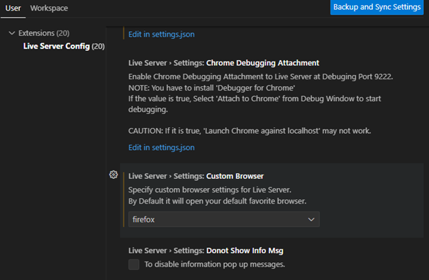
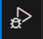
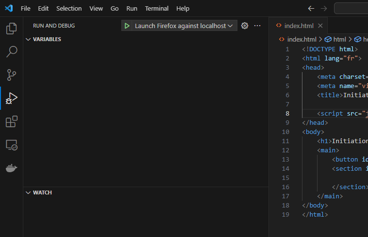

# Procédure de mise en place du debugger dans VSCode

Procédure permettant de mettre en place un environnement de développement Javascript sous VSCode afin de bénéficier du « hot reload » et de la puissance du  débugger (breakpoint, observation des variables…).

1. Installez l’extension [Live Server](https://marketplace.visualstudio.com/items?itemName=ritwickdey.LiveServer) sur VSCode.

2. Sélectionner un navigateur dans les paramètres de l'extension Live Server.



**Note** : pour Firefox il vous faut en plus l’extension « [Firefox Dev Tools](https://marketplace.visualstudio.com/publishers/firefox-devtools) ». 

3. Cliquer sur l'icône de debug sur VSCode via l'icône suivante :



4. Ajouter une configuration de debug pour votre navigateur (exemple suivant pour Firefox) :

```json
{
    "version": "0.2.0",
    "configurations": [
        {
            "type": "firefox",
            "request": "launch",
            "name": "Launch Firefox against localhost",
            "url": "http://localhost:5500",
            "webRoot": "${workspaceFolder}"
        }
    ]
}
```

5. Cliquer sur "Go Live" pour démarrer le "Live Server"

6. Démarrer la session de deboggage sur VSCode



7. Enjoy la puissance du debugger dans VSCode !