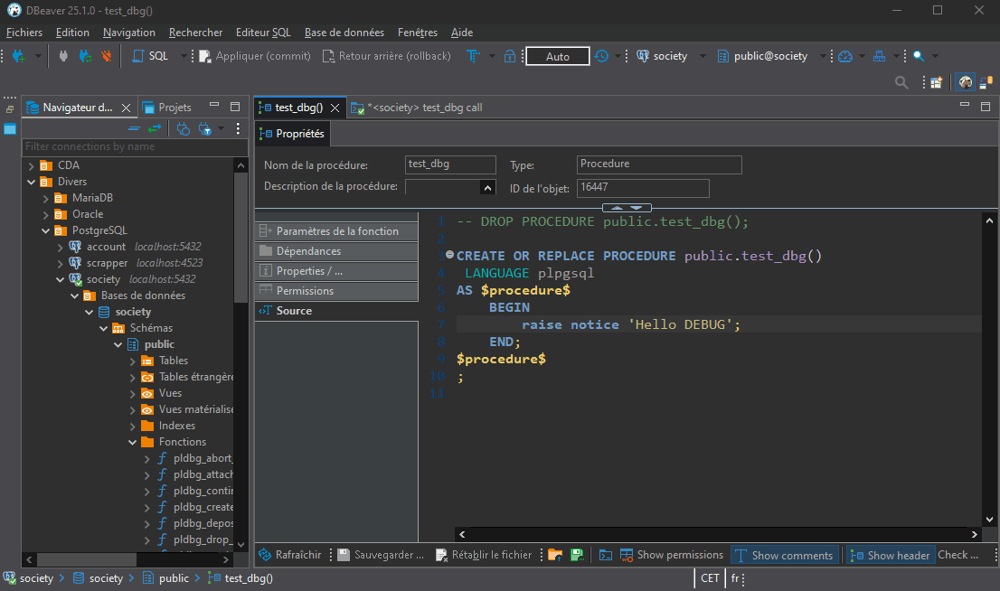
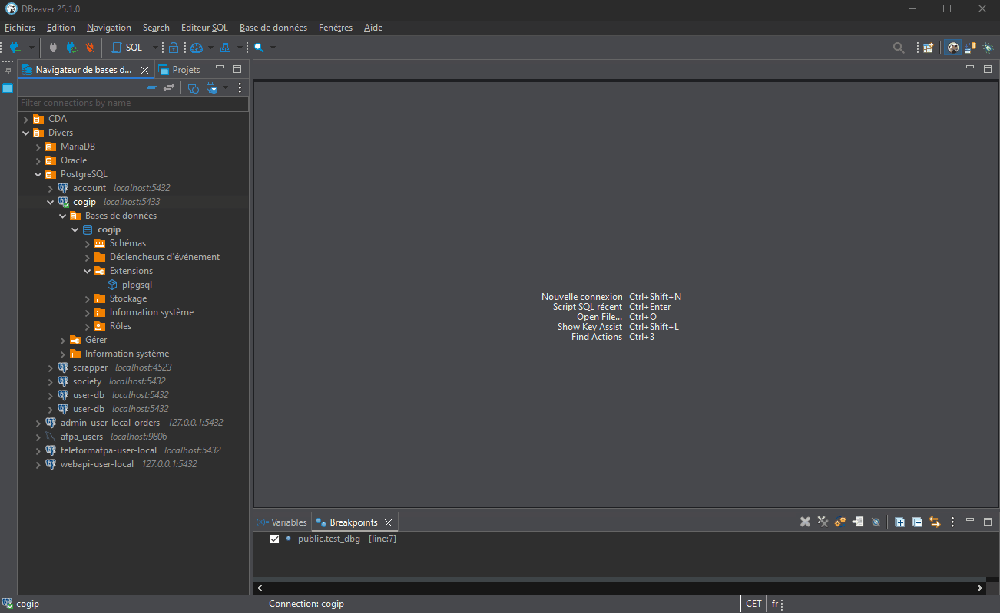

# Descriptif de la procédure

Vous trouverez ci-dessous un ensemble d'informations vous permettant de mettre en place un conteneur docker PostgreSQL avec le paramétrage suivant :
- configuration du SGBD en français
- utilisation de l'UTF-8

Une seconde partie vous aiguillera pour mettre en place le client SQL [DBeaver](https://dbeaver.io/) :
- installation de DBeaver
- paramétrage du debugger pour le développement PL/pgSQL

Un exemple complet d'un SGBD conteneurisé fonctionnel est [disponible ici](https://github.com/ludovic-esperce/cogip-db).

# Mise en place du SGBD conteneurisé

Afin de créer un conteneur il vous faudra utiliser plusieurs fichiers de configuration :
- [1 fichier de configuration `postgresql.conf` sur-mesure](https://github.com/ludovic-esperce/cogip-db/blob/main/config/postgresql.conf)

Ce fichier contient la ligne suivante qui permet de charger la librairie de debug au sein du SGBD.

```conf
shared_preload_libraries = 'plugin_debugger'
```

- [1 fichier de création d'image `Dockerfile`](https://github.com/ludovic-esperce/cogip-db/blob/main/config/Dockerfile)
- [1 fichier de composition `docker-compose.yml`](https://github.com/ludovic-esperce/cogip-db/blob/main/docker-compose.yml)
- 1 dump de BD

Voici une proposition d'organisation de ces différent fichiers

```text
|   .env
|   docker-compose.yml
|
+---config
|       Dockerfile
|       postgresql.conf
|
+---dump
|       create-db.sql
\
```

> [!TIP]
> Se référer aux commentaires contenus dans les fichiers de configuration pour en apprendre plus sur le fonctionnement de Docker.

Pour instancier le container, exécuter la commande suivante :

```bash
docker compose -d
```

# Installation et configuration de DBeaver

## Utilisation du debugger pour PL/pgSQL

PL/pgSQL permet de développer du **code procédural** pour une base de données Postgres.

Ceci a plusieurs intérêts :
- ajout de structures de contrôle au langage SQL (if/boucle...)
- code dédié et optimisé pour le traitement des données et au SQL
- permet d'effectuer des traitements complexes sur les données
- permet de mettre en place des mécanismes d'intégrité des données

Comme tout code procédural, il est important de pouvoir utiliser un debugger afin de simplifier le développement (utilisation de point d'arrêt, observation des variables...).

### Activation des outils de débogage sur DBeaver

Deux choses sont à faire sur DBeaver : 
1. installer les outils de debuggage de DBeaver



2. ajouter l'extension `pldbgapi`



### Création d'une fonction

La création d'une **fonction/procédure** peut se faire via l'utilisation de DBeaver comme présenté ci-dessous :


### Ajout de point d'arrêt et activation du débogage


